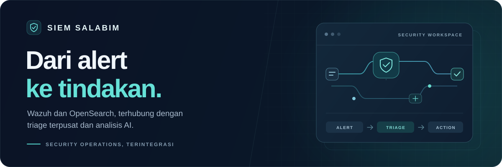
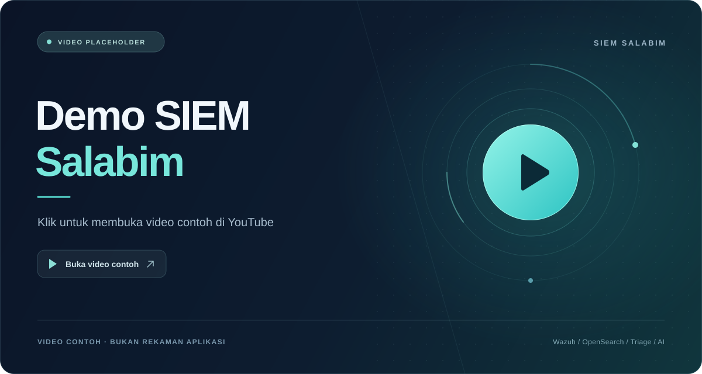

<a id="top"></a>

<div align="center">



# SIEM Salabim

**Pantau alert. Tentukan prioritas. Dokumentasikan respons.**

Satu ruang kerja untuk tim SOC: dari alert Wazuh, triage, dan bantuan AI hingga notifikasi Telegram.

<p>
  <a href="https://github.com/SundaXploit/siem_salabim/stargazers"></a>
  <a href="https://github.com/SundaXploit/siem_salabim/forks"></a>
  <a href="https://github.com/SundaXploit/siem_salabim/issues"></a>
</p>

<p>
  
  
  
  
</p>

**[▶ Demo](#demo)** · **[✨ Fitur](#fitur)** · **[🚀 Instalasi](#instalasi)** · **[🔑 Akun bawaan](#akun-bawaan)** · **[💬 Beri masukan](#kontribusi)**

</div>

---

## Kenalan dengan Salabim

SIEM Salabim membantu analyst **melihat apa yang terjadi, memilih alert yang perlu ditangani, dan mencatat tindak lanjutnya**. Aplikasi mengambil alert dari OpenSearch/Wazuh Indexer dan menyimpannya ke database lokal untuk kebutuhan operasional SOC.

Deteksi awal tetap dilakukan Wazuh. Salabim menyediakan antarmuka untuk pemantauan, triage, dokumentasi, dan komunikasi insiden. Data yang tampil mengikuti periode serta filter impor yang dipilih; analisis AI menjadi bahan pertimbangan analyst.

| 01 · Pantau | 02 · Selidiki | 03 · Tindak lanjuti |
| :--- | :--- | :--- |
| Lihat ringkasan SOC dan alert terbaru. | Buka detail rule, agent, bukti, dan analisis AI. | ACK atau abaikan dengan alasan, lalu kirim notifikasi. |

<a id="demo"></a>

## ▶ Lihat alurnya

<div align="center">

<!-- DEMO VIDEO: Ganti URL YouTube di dua tautan pada bagian ini saat video asli siap. -->
<a href="https://www.youtube.com/watch?v=aqz-KE-bpKQ">
  
</a>

**[▶ Buka video contoh di YouTube](https://www.youtube.com/watch?v=aqz-KE-bpKQ)**

*Video sementara: Big Buck Bunny dari Blender Foundation. Ini placeholder, bukan rekaman aplikasi SIEM Salabim.*

</div>

<details>
<summary><strong>🎬 Ingin mengganti dengan video demo sendiri?</strong></summary>

1. Upload rekaman ke YouTube.
2. Ganti kedua URL YouTube pada bagian **Lihat alurnya** di `README.md`.
3. Ganti `docs/assets/demo-preview.svg` dengan cover pilihan Anda, lalu sesuaikan teks placeholder dan alt gambar.

Alur rekaman yang disarankan: **login → dashboard → Live Alerts → triage massal → detail dan AI → notifikasi Telegram**. Gunakan data contoh yang sudah disanitasi.

Preview berupa gambar yang dapat diklik. Video dibuka di YouTube; README GitHub tidak menggunakan pemutar iframe atau JavaScript.

</details>

<a id="fitur"></a>

## ✨ Yang bisa Anda lakukan

| Fitur | Manfaat untuk analyst |
| :--- | :--- |
| 📊 **Dashboard SOC** | Baca tren bulan berjalan, severity, dan kesimpulan analitis AI. |
| 🔴 **Live Alerts** | Cari dan filter alert, pilih 25/50/100 baris, serta ikuti pembaruan otomatis. |
| ☑️ **Triage massal** | Klik **Triage massal** untuk memunculkan checkbox; ACK atau abaikan hingga 100 alert per permintaan. |
| 🔎 **Detail & AI alert** | Tinjau rule, agent, bukti, dan bantuan analisis sebelum menentukan tindakan. |
| 📨 **Telegram** | Kirim laporan berbasis template dan bukti gambar ke chat pilihan. |
| 🗂️ **Riwayat & leaderboard** | Telusuri penanganan, notifikasi, dan aktivitas analyst. |
| ⚙️ **Administrasi** | Kelola akun, integrasi, ambang impor, serta fetch manual. |
| 💾 **Pengelolaan data** | Preview cakupan, ekspor JSON/SQL, dan kelola retensi berdasarkan periode. |

<details>
<summary><strong>🧭 Bagaimana data mengalir?</strong></summary>

```text
Wazuh agents → Wazuh Manager → OpenSearch / Wazuh Indexer
                                          ↓
                              Fetch berdasarkan filter
                                          ↓
                               Database SIEM Salabim
                                          ↓
                        Dashboard · Live Alerts · Triage
                                  ↙               ↘
                            Analisis AI        Telegram
```

Fetch reguler mengambil maksimal 100 alert terbaru hari ini secara default. Tombol fetch manual memeriksa seluruh halaman hari ini, berdasarkan zona **Asia/Jakarta**. Alert yang sudah tersimpan akan dilewati.

</details>

<a id="instalasi"></a>

## 🚀 Mulai dari sini

**Siapkan:** PHP **8.3+**, Composer 2, Node.js **22.12+** (atau 20.19+), serta SQLite untuk instalasi cepat. OpenSearch diperlukan untuk mengimpor alert; Telegram dan AI dapat dikonfigurasi kemudian.

<details>
<summary><strong>📦 Lihat kebutuhan PHP dan pilihan database</strong></summary>

- Ekstensi PHP: Ctype, cURL, DOM, Fileinfo, Filter, Hash, Mbstring, OpenSSL, PCRE, PDO, Session, Tokenizer, dan XML.
- Aktifkan `pdo_sqlite` dan `sqlite3` untuk SQLite/pengujian, atau `pdo_mysql` untuk MySQL/MariaDB.
- Pastikan PHP CLI dan web server memakai versi serta ekstensi yang sesuai, terutama pada Laragon.
- Untuk MySQL/MariaDB, buat database dan atur `DB_*` **sebelum migrasi**. Lihat [panduan MySQL](docs/OPERATIONS.md#menggunakan-mysqlmariadb).

</details>

### 1. Ambil kode dan dependency

```bash
git clone https://github.com/SundaXploit/siem_salabim.git
cd siem_salabim
composer install
npm ci
```

### 2. Siapkan konfigurasi

Perintah berikut dapat dijalankan dari PowerShell maupun terminal Linux/macOS:

```bash
php -r "file_exists('.env') || copy('.env.example', '.env');"
php -r "file_exists('database/database.sqlite') || touch('database/database.sqlite');"
```

Atur `APP_URL` di `.env` menjadi `http://127.0.0.1:8000`, atau domain Laragon Anda. Konfigurasi contoh memakai SQLite.

### 3. Buat database dan akun bawaan

```bash
php artisan key:generate
php artisan migrate --seed
npm run build
```

> [!IMPORTANT]
> `key:generate` hanya untuk instalasi baru. Pertahankan `.env` dan `APP_KEY` pada instalasi yang sudah berjalan agar kredensial terenkripsi tetap dapat dibaca.

### 4. Jalankan dan masuk

```bash
composer run dev
```

Buka **[http://127.0.0.1:8000](http://127.0.0.1:8000)**. Perintah ini menjalankan server aplikasi, worker queue AI, scheduler, dan Vite.

<a id="akun-bawaan"></a>

## 🔑 Akun bawaan

Setelah `php artisan migrate --seed`, login menggunakan **email** berikut:

| Peran | Email | Password | Akses |
| :--- | :--- | :--- | :--- |
| **Admin SOC** | `adminsoc@siem.local` | `bhapp` | Operasional SOC, Settings, integrasi, dan pengelolaan pengguna. |
| **Analis SOC** | `analissoc@siem.local` | `bhapp` | Dashboard, alert, triage, dan notifikasi sesuai akses analyst. |

Form login menggunakan **email dan password**. Akun lama tetap dapat login dengan email yang sudah terdaftar.

> [!WARNING]
> Kredensial bawaan ini dipublikasikan untuk memudahkan instalasi/demo. **Ganti password kedua akun sebelum aplikasi digunakan secara publik**, atau buat akun pribadi dan hapus akun bawaan yang tidak diperlukan.

<details>
<summary><strong>Sudah punya instalasi? / Ingin membuat admin sendiri?</strong></summary>

Untuk menambahkan akun bawaan pada instalasi yang sudah ada:

```bash
php artisan migrate
php artisan db:seed
```

Seeder membuat akun berdasarkan email yang belum terdaftar; password, role, dan identitas akun existing tidak ditimpa. Jika email sudah digunakan, periksa pesan seeder dan selesaikan melalui pengelolaan pengguna.

Untuk instalasi dengan akun admin pribadi, jalankan migrasi tanpa `--seed`, lalu:

```bash
php artisan siem:create-admin
```

Perintah ini meminta nama, email, serta password minimal 12 karakter dengan input tersembunyi. Login menggunakan email tersebut. Registrasi publik tetap dinonaktifkan.

</details>

## 🛠️ Hubungkan layanan Anda

Login sebagai admin → buka **Settings** → simpan konfigurasi → gunakan tombol uji koneksi.

| Layanan | Yang perlu disiapkan | Panduan |
| :--- | :--- | :--- |
| **OpenSearch / Wazuh Indexer** | Host, akun pembaca indeks, pola indeks, dan ambang level. | [Konfigurasi & perintah fetch](docs/OPERATIONS.md#opensearch--wazuh-indexer) |
| **Telegram** | Token bot dan chat tujuan yang dapat diakses bot. | [Konfigurasi Telegram](docs/OPERATIONS.md#telegram) |
| **AmanAI** | API key serta model yang tersedia untuk akun Anda. | [Konfigurasi & cakupan data AI](docs/OPERATIONS.md#analisis-ai) |

Kelola host dan kredensial integrasi, model AI, ambang level, serta interval analisis melalui **Settings**. `.env.example` memuat konfigurasi server seperti database, SMTP, session/cache/queue, serta parameter teknis koneksi. Worker **`ai,default`** dan scheduler perlu tetap berjalan untuk pekerjaan otomatis.

<details>
<summary><strong>💻 Menggunakan virtual host Laragon?</strong></summary>

Arahkan document root ke **`public/`** dan sesuaikan `APP_URL`, misalnya `http://siem_salabim.test`. Jalankan setiap perintah berikut di terminal terpisah:

```bash
npm run dev
php artisan queue:work --queue=ai,default --sleep=3 --tries=2 --timeout=180
php artisan schedule:work
```

Jalankan satu scheduler untuk setiap instalasi. Lihat [deployment dan operasional](docs/OPERATIONS.md#deployment-dan-operasional) untuk layanan yang berjalan permanen.

</details>

## 📚 Butuh panduan lebih detail?

| Saya ingin… | Buka |
| :--- | :--- |
| Memahami filter tanggal, level, dan fetch manual | [OpenSearch & impor alert](docs/OPERATIONS.md#opensearch--wazuh-indexer) |
| Mengetahui data yang dikirim ke AI | [Analisis AI](docs/OPERATIONS.md#analisis-ai) |
| Deploy dengan scheduler dan queue | [Deployment](docs/OPERATIONS.md#deployment-dan-operasional) |
| Mengelola backup dan retensi | [Backup & penghapusan data](docs/OPERATIONS.md#backup-dan-penghapusan-data) |
| Menjalankan tes atau berkontribusi kode | [Pengujian](docs/OPERATIONS.md#pengujian) |
| Memeriksa file sebelum commit | [Panduan Git](docs/OPERATIONS.md#sebelum-commit-dan-push) |

<details>
<summary><strong>❓ Pertanyaan yang sering muncul</strong></summary>

**Fetch berhasil tetapi `New: 0`?**

Hasil mungkin sudah pernah diimpor, atau tidak ada alert yang cocok dengan tanggal, indeks, dan ambang level. Koneksi berhasil tidak berarti setiap filter memiliki hasil.

**AI lambat atau belum menghasilkan analisis?**

Uji koneksi dan model di Settings. Pastikan API key valid, provider tersedia, dan worker `ai,default` berjalan untuk job otomatis. Profil default meminta `reasoning_effort=none`; kecepatannya tetap bergantung pada provider.

**Akun bawaan tidak bisa login?**

Pastikan migrasi dan seeder sudah dijalankan. Jika password akun pernah diganti, gunakan password terbaru; seeder tidak meresetnya. Periksa juga pesan email yang sudah terdaftar dari seeder.

**Apakah AI menggantikan analyst?**

Hasil AI membantu investigasi. Keputusan triage dan respons tetap perlu divalidasi oleh analyst SOC.

</details>

<a id="kontribusi"></a>

## 💬 Bantu Salabim berkembang

Punya temuan bug, ide fitur, atau alur SOC yang bisa dibuat lebih nyaman? Masukan dari penggunaan nyata sangat membantu.

| Ingin membantu? | Mulai di sini |
| :--- | :--- |
| ⭐ **Dukung proyek** | Klik tombol **Star** di bagian atas repository agar proyek mudah ditemukan kembali. |
| 🐞 **Laporkan bug** | [Buat laporan bug](https://github.com/SundaXploit/siem_salabim/issues/new?template=bug_report.yml) dengan langkah reproduksi dan hasil yang diharapkan. |
| 💡 **Usulkan fitur / beri masukan** | [Kirim ide Anda](https://github.com/SundaXploit/siem_salabim/issues/new?template=feature_request.yml), termasuk masalah yang ingin diselesaikan. |
| 🧩 **Kontribusi kode atau dokumentasi** | Fork repository, buat branch, jalankan pengujian yang relevan, lalu buka pull request. |

Sertakan log atau screenshot yang sudah disanitasi. Jangan cantumkan token, password operasional, raw log sensitif, atau data insiden privat pada issue publik.

<div align="center">

**Salabim membantu pekerjaan SOC Anda? Beri ⭐ dan ceritakan pengalaman Anda.**

[⭐ Buka repository](https://github.com/SundaXploit/siem_salabim) · [💬 Semua issue](https://github.com/SundaXploit/siem_salabim/issues) · [🧩 Pull requests](https://github.com/SundaXploit/siem_salabim/pulls)

---

**Dibangun untuk pekerjaan SOC yang lebih terarah.**

[Kembali ke atas ↑](#top)

<sub>Lisensi distribusi aplikasi belum ditetapkan. Dependency pihak ketiga mengikuti lisensinya masing-masing.</sub>

</div>
